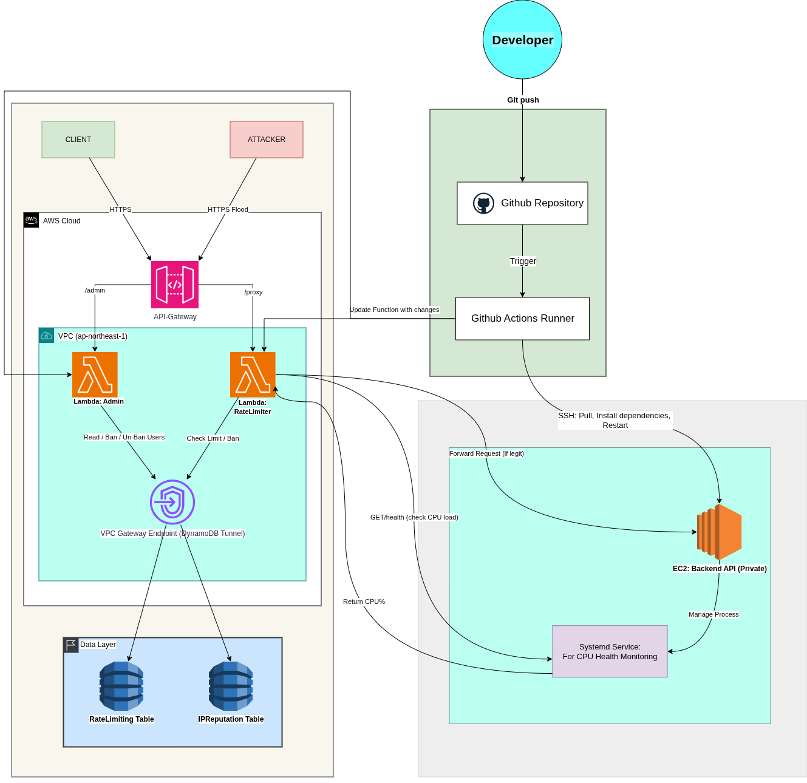

# FluxControl: Serverless API Rate Limiter

[](https://github.com/saransridatha/fluxcontrol) [](https://github.com/saransridatha/fluxcontrol/actions/workflows/deploy.yml) [](https://aws.amazon.com/serverless/) [](https://www.python.org/) [](LICENSE)

FluxControl is a cloud-native security middleware designed to protect backend APIs from abusive traffic. Built on AWS Serverless architecture, it provides low-latency traffic shaping, distributed atomic counting, and automated IP reputation management.

---

## Architecture

FluxControl utilizes a VPC-isolated microservices pattern to ensure backend services are not exposed to the public internet.



### Key Components
*   **Traffic Controller (AWS Lambda):** The core "Bouncer" service (`RateLimiterLogic`) that inspects every request. It runs inside a private VPC subnet.
*   **State Store (Amazon DynamoDB):** Two tables (`RateLimitTable`, `IPReputationTable`) manage state. It uses DynamoDB's Atomic Counters to handle high-concurrency requests without race conditions.
*   **The Backend (Amazon EC2):** A private API server, reachable only by the Lambda function via its private IP address.
*   **Admin Console (AWS Lambda):** A separate function (`fluxcontrolAdmin`) provides an API for monitoring and manual intervention.

---

## Features

### 1. Clock-Aligned Rate Limiting
FluxControl uses a **Clock-Aligned Fixed Window** algorithm for deterministic and fair request throttling. The count resets for all users at the beginning of each window (e.g., at `hh:mm:00`, `hh:mm:10`, etc.).
*   **Limit:** 5 Requests per 10 Seconds.
*   **Action:** Returns an HTTP `429 Too Many Requests` status code upon violation.

### 2. Automated IP Reputation System
The system tracks violations to identify and block consistently abusive clients.
*   **Violation Tracking:** Every `429` response increments a violation counter for the source IP address.
*   **Ban Threshold:** An IP address exceeding 50 violations in a day is automatically banned for 24 hours.
*   **Enforcement:** Banned IPs receive an HTTP `403 Forbidden` response instantly, preventing them from consuming any further resources.

### 3. Secure Network Design
*   **No Public Backend Access:** The backend EC2 instance is not directly accessible from the public internet.
*   **VPC Communication:** The Lambda function communicates with the backend service securely over the private AWS network.
*   **Optimized Connectivity:** A VPC Gateway Endpoint is used to allow the Lambda function to access DynamoDB, which is more secure and cost-effective than using a NAT Gateway.

---

## Tech Stack

*   **Cloud Provider:** AWS (Amazon Web Services)
*   **Compute:** AWS Lambda, Amazon EC2
*   **Database:** Amazon DynamoDB
*   **Networking:** Amazon API Gateway, VPC, Security Groups
*   **Language:** Python

---

## API Usage

### 1. Protected Proxy Endpoint
Proxies requests to the backend service if the rate limit is not exceeded.
```bash
# A successful request that gets forwarded
curl https://{api_id}.execute-api.ap-northeast-1.amazonaws.com/dev/proxy

# A blocked request after exceeding the limit
curl https://{api_id}.execute-api.ap-northeast-1.amazonaws.com/dev/proxy
# Output: {"error": "Too Many Requests", "message": "Slow down or you will be banned."}
```
### 2. Admin Management API
Allows for monitoring and manual control over IP reputations.
```bash
# Get a list of all IPs with a recorded reputation
curl https://{api_id}.execute-api.ap-northeast-1.amazonaws.com/dev/admin

# Manually ban an IP address for 24 hours
curl -X POST https://{api_id}.execute-api.ap-northeast-1.amazonaws.com/dev/admin \
     -H "Content-Type: application/json" \
     -d '{"ip": "1.2.3.4", "action": "ban"}'
```
---
## Project Structure

```
fluxcontrol/
├── .github/
│   └── workflows/
│       └── deploy.yml
├── docs/
│   ├── ADR.md
│   ├── PRD.md
│   ├── RFC.md
│   └── RUNBOOK.md
├── src/
│   ├── fluxcontrolAdmin.py
│   └── RateLimiterLogic.py
├── LICENSE
└── README.md
```

---

## CI/CD

This project uses GitHub Actions for continuous integration and continuous deployment.
The workflow is defined in `.github/workflows/deploy.yml`.

On every push to the `main` branch that includes changes in the `src` directory, the workflow will automatically deploy the AWS Lambda functions.

The workflow performs the following steps:
1. Checks out the code.
2. Sets up Python 3.9.
3. Installs the `zip` tool.
4. Packages `RateLimiterLogic.py` into `lambda_function.zip`.
5. Deploys `RateLimiterLogic` to AWS Lambda.
6. Packages `fluxcontrolAdmin.py` into `lambda_function.zip`.
7. Deploys `fluxcontrolAdmin` to AWS Lambda.

The deployment requires the following secrets to be configured in the GitHub repository:
- `AWS_ACCESS_KEY_ID`
- `AWS_SECRET_ACCESS_KEY`
- `AWS_REGION`
---

## License
This project is licensed under the MIT License - see the `LICENSE` file for details.
