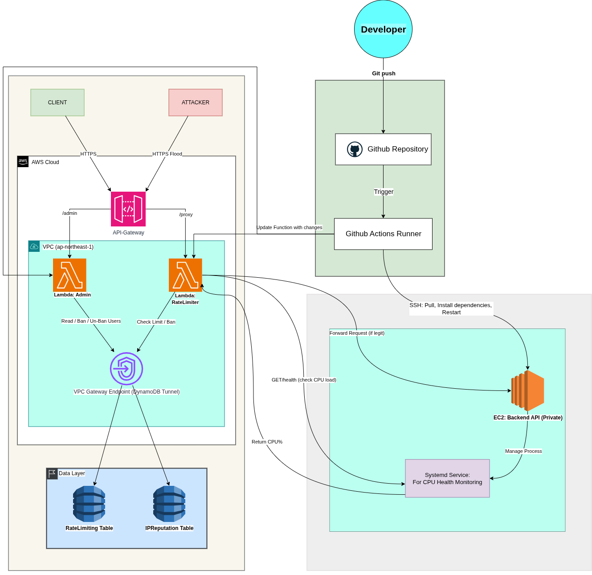

# FluxControl: Serverless API Rate Limiter

[](https://github.com/saransridatha/fluxcontrol) [](https://github.com/saransridatha/fluxcontrol/actions/workflows/deploy.yml) [](https://github.com/saransridatha/fluxcontrol/actions/workflows/deploy-backend.yml) [](https://aws.amazon.com/serverless/) [](https://www.python.org/) [](LICENSE)

FluxControl is a cloud-native security middleware designed to protect backend APIs from abusive traffic. Built on an AWS Serverless architecture, it provides low-latency traffic shaping, distributed atomic counting, and automated IP reputation management.

---
## Getting Started

To deploy FluxControl, you will need an AWS account and the AWS CLI configured. The project is deployed using GitHub Actions, which automates the deployment of the Lambda functions and the EC2 backend.

For detailed setup instructions, please refer to the [RUNBOOK](docs/RUNBOOK.md).

## Architecture

FluxControl utilizes a VPC-isolated microservices pattern to ensure backend services are not exposed to the public internet.



### Key Components
*   **Traffic Controller (AWS Lambda):** The core "Bouncer" service (`RateLimiterLogic`) that inspects every request. It runs inside a private VPC subnet.
*   **State Store (Amazon DynamoDB):** Three tables (`RateLimitTable`, `IPReputationTable`, and `FluxConfig`) manage state. It uses DynamoDB's Atomic Counters to handle high-concurrency requests without race conditions.
*   **The Backend (Amazon EC2):** A private API server, running as a `systemd` service, reachable only by the Lambda function via its private IP address. Note that the backend IP is hardcoded in the `RateLimiterLogic` Lambda function.
*   **Admin Console (AWS Lambda):** A separate function (`fluxcontrolAdmin`) provides an API for monitoring and manual intervention.

---

## Features

### 1. Clock-Aligned Rate Limiting
FluxControl uses a **Clock-Aligned Fixed Window** algorithm for deterministic and fair request throttling. The count resets for all users at the beginning of each window (e.g., at `hh:mm:00`, `hh:mm:10`, etc.).
*   **Limit:** 5 Requests per 10 Seconds.
*   **Action:** Returns an HTTP `429 Too Many Requests` status code upon violation.

### 2. Automated IP Reputation System
The system tracks violations to identify and block consistently abusive clients.
*   **Violation Tracking:** Every `429` response increments a violation counter for the source IP address.
*   **Ban Threshold:** An IP address exceeding 50 violations in a day is automatically banned for 24 hours.
*   **Enforcement:** Banned IPs receive an HTTP `403 Forbidden` response instantly, preventing them from consuming any further resources.

### 3. Adaptive Rate Limiting
FluxControl can dynamically adjust the rate limit based on the backend server's health.
*   **Health Check:** The `RateLimiterLogic` Lambda function polls the backend's `/health` endpoint to get the current CPU usage.
*   **Throttling:** If the CPU usage exceeds a configurable threshold, the rate limit is automatically lowered to reduce the load on the backend.

### 4. Shield Mode (Proof-of-Work)
A defense mechanism against DDoS attacks. When enabled, all incoming requests must include a valid solution to a computational puzzle in the `X-Puzzle-Solution` header.

### 5. Seamless Mode (VIP)
Allows specific IP addresses to bypass all rate limiting and security checks. This is useful for trusted clients or for testing purposes.

### 6. Secure Network Design
*   **No Public Backend Access:** The backend EC2 instance is not directly accessible from the public internet.
*   **VPC Communication:** The Lambda function communicates with the backend service securely over the private AWS network.
*   **Optimized Connectivity:** A VPC Gateway Endpoint is used to allow the Lambda function to access DynamoDB, which is more secure and cost-effective than using a NAT Gateway.

---

## Configuration

The system is configured via the `FluxConfig` table in DynamoDB. The following parameters can be configured:

*   **`mode`:** The system mode. Can be `normal` or `shield`.
*   **`difficulty`:** The difficulty of the proof-of-work puzzle in `shield` mode.
*   **`cpu_threshold`:** The CPU usage threshold for adaptive rate limiting.

---

## Tech Stack

*   **Cloud Provider:** AWS (Amazon Web Services)
*   **Compute:** AWS Lambda, Amazon EC2
*   **Database:** Amazon DynamoDB
*   **Networking:** Amazon API Gateway, VPC, Security Groups
*   **Language:** Python

---

## API Usage

For detailed information on the API endpoints, request/response formats, and advanced features like Shield Mode, please see the [API Documentation](docs/API.md).

### 1. Protected Proxy Endpoint
Proxies requests to the backend service if the rate limit is not exceeded.
```bash
# A successful request that gets forwarded
curl https://{api_id}.execute-api.ap-northeast-1.amazonaws.com/dev/proxy

# A blocked request after exceeding the limit
curl https://{api_id}.execute-api.ap-northeast-1.amazonaws.com/dev/proxy
# Output: {"error": "Too Many Requests", "message": "Slow down or you will be banned."}
```
### 2. Admin Management API
Allows for monitoring and manual control over IP reputations.
```bash
# Get a list of all IPs with a recorded reputation
curl https://{api_id}.execute-api.ap-northeast-1.amazonaws.com/dev/admin

# Manually ban an IP address for 24 hours
curl -X POST https://{api_id}.execute-api.ap-northeast-1.amazonaws.com/dev/admin \
     -H "Content-Type: application/json" \
     -d '{"ip": "1.2.3.4", "action": "ban"}'

# Manually unban an IP address
curl -X POST https://{api_id}.execute-api.ap-northeast-1.amazonaws.com/dev/admin \
     -H "Content-Type: application/json" \
     -d '{"ip": "1.2.3.4", "action": "unban"}'

# Put an IP in seamless mode (VIP)
curl -X POST https://{api_id}.execute-api.ap-northeast-1.amazonaws.com/dev/admin \
     -H "Content-Type: application/json" \
     -d '{"ip": "1.2.3.4", "action": "seamless"}'

# Revoke seamless mode for an IP
curl -X POST https://{api_id}.execute-api.ap-northeast-1.amazonaws.com/dev/admin \
     -H "Content-Type: application/json" \
     -d '{"ip": "1.2.3.4", "action": "unseamless"}'

# Configure the system mode
curl -X POST https://{api_id}.execute-api.ap-northeast-1.amazonaws.com/dev/admin \
     -H "Content-Type: application/json" \
     -d '{"action": "config", "mode": "shield"}'
```
---
## Project Structure

```
fluxcontrol/
├── .github/
│   └── workflows/
│       ├── deploy-backend.yml  # Deploys the EC2 backend
│       └── deploy.yml          # Deploys the Lambda functions
├── docs/
│   ├── ADR.md                  # Architecture Decision Records
|   ├── API.md                  # API Documentation
│   ├── PRD.md                  # Product Requirements Document
│   ├── RFC.md                  # Request for Comments
│   └── RUNBOOK.md              # System Setup and Recovery
├── experiments/
│   ├── clients/
│   │   ├── adaptive_monitor.js # Tests adaptive rate limiting
│   │   └── smart_client.js     # Tests shield mode
│   └── infrastructure/
│       └── burn_cpu.py         # Stresses the backend CPU
├── src/
│   ├── backend/
│   │   ├── main.py             # FastAPI backend application
│   │   └── requirements.txt
│   └── lambda/
│       ├── fluxcontrolAdmin.py # Admin API Lambda function
│       ├── RateLimiterLogic.py # Core rate limiting Lambda function
│       └── requirements.txt
├── LICENSE
└── README.md
```

---
## Local Development

While the project is designed for a serverless environment, you can test the backend component locally.

### Backend
1.  Navigate to the `src/backend` directory.
2.  Install the dependencies: `pip install -r requirements.txt`
3.  Run the FastAPI server: `uvicorn main:app --reload`

The backend will be available at `http://127.0.0.1:8000`.

### Lambda Functions

Testing the Lambda functions locally is more complex due to their tight integration with AWS services. It is recommended to deploy them to a development environment in AWS for testing.

The `experiments/clients` directory contains scripts that can be used to test the deployed Lambda functions.

---

## CI/CD

This project uses GitHub Actions for continuous integration and continuous deployment.

### Lambda Deployment
The workflow is defined in `.github/workflows/deploy.yml`.

On every push to the `main` branch that includes changes in the `src/lambda` directory, the workflow will automatically deploy the AWS Lambda functions.

The deployment requires the following secrets to be configured in the GitHub repository:
- `AWS_ACCESS_KEY_ID`
- `AWS_SECRET_ACCESS_KEY`
- `AWS_REGION`

### EC2 Backend Deployment
The workflow is defined in `.github/workflows/deploy-backend.yml`.

On every push to the `main` branch that includes changes in the `src/backend` directory, the workflow will automatically deploy the EC2 backend.

The deployment requires the following secrets to be configured in the GitHub repository:
- `EC2_HOST`
- `EC2_SSH_KEY`
---

## License
This project is licensed under the MIT License - see the `LICENSE` file for details.
